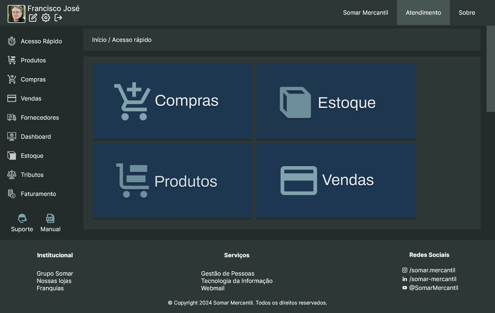
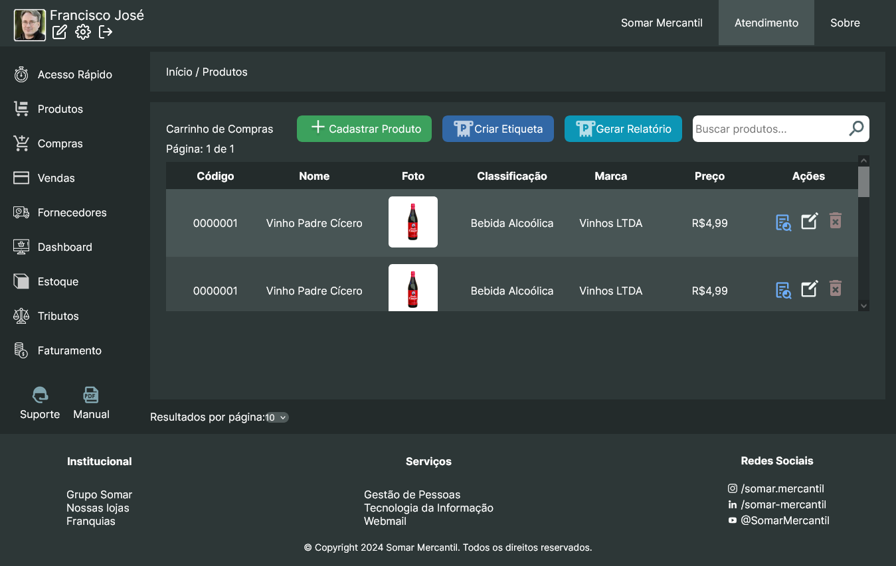
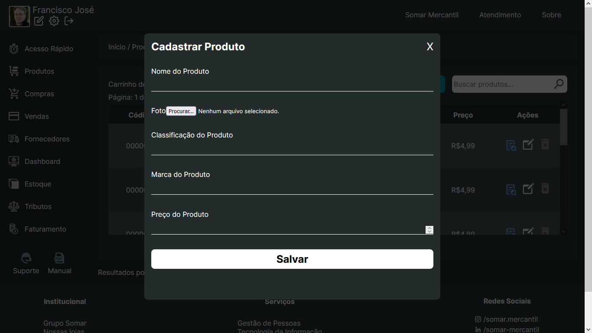

# Somar Mercantil - Sistema WEB

Projeto (front-end) de um MVP-Web da disciplina de Projeto Integrado III da Universidade Federal do Cariri (UFCA)

Link: https://italomaia03.github.io/projeto-integrado-III/

## Autores:

* [Francisco Eliésio de Sousa Silva](https://github.com/fcoeliesio), 2022010203.

* [Gustavo Pereira de Aragão](https://github.com/McGusT99), 2022010992.

* [Ítalo Fernandes de Oliveira Maia](https://github.com/italomaia03), 2022012656.

## Tecnologias Utilizadas:

## Screenshots:

## Estrutura do Projeto:

* O design do __[projeto](https://www.figma.com/file/8G1OjzN2wYm2Eu7faB3p7y/controle_de_estoque?type=design&node-id=0%3A1&mode=design&t=3fFgEXMAYoyz1Xet-1)__ foi desenvolvido no Figma.

## Instruções de Execução:

Para executar o projeto localmente, basta efetuar o download do repositório e abrir o arquivo __index.html__ em um navegador da web.